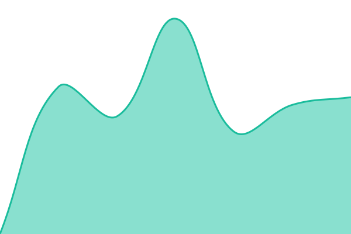
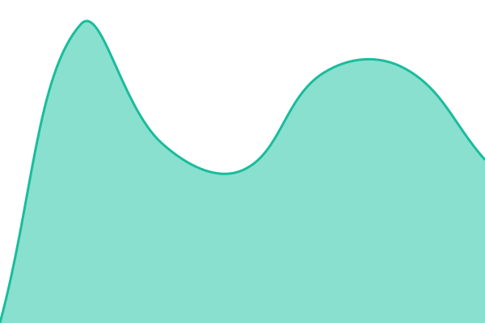

# 📈 Status na żywo: <!--live status--> **🟩 All systems operational**

To repozytorium monitoruje dostępność aplikacji z ekosystemu [kocie.mba](https://kocie.mba) — **ADR apka**, **ADR EDI** i **TACHO app**. **[kociembadamian.github.io/uptime](https://kociembadamian.github.io/uptime)**.

Duże podziękowania dla [Anand Chowdhary](https://anandchowdhary.com) i wszystkich, którzy tworzą i rozwijają Upptime — bez tego projektu postawienie własnego monitoringu zajęłoby mi znacznie więcej czasu.

<!--start: status pages-->
<!-- This summary is generated by Upptime (https://github.com/upptime/upptime) -->
<!-- Do not edit this manually, your changes will be overwritten -->
<!-- prettier-ignore -->
| URL | Status | History | Response Time | Uptime |
| --- | ------ | ------- | ------------- | ------ |
|  [ADR apka](https://app.kocie.mba) | 🟩 Up | [adr-apka.yml](https://github.com/kociembadamian/uptime/commits/HEAD/history/adr-apka.yml) | 

 965ms
     
 | 

<a href="https://kociembadamian.github.io/uptime/history/adr-apka">100.00%</a>
    

|  [ADR EDI](https://edi.kocie.mba) | 🟩 Up | [adr-edi.yml](https://github.com/kociembadamian/uptime/commits/HEAD/history/adr-edi.yml) | 

 717ms
     
 | 

<a href="https://kociembadamian.github.io/uptime/history/adr-edi">100.00%</a>
    

|  [TACHO app](https://tacho.kocie.mba) | 🟩 Up | [tacho-app.yml](https://github.com/kociembadamian/uptime/commits/HEAD/history/tacho-app.yml) | 

 829ms
     
 | 

<a href="https://kociembadamian.github.io/uptime/history/tacho-app">100.00%</a>
    

<!--end: status pages-->

[**Zobacz stronę statusu →**](https://kociembadamian.github.io/uptime)

## 📄 Licencja

- Monitoring działa dzięki: [Upptime](https://github.com/upptime/upptime)
- Kod: [MIT](./LICENSE) © [Anand Chowdhary](https://anandchowdhary.com)
- Dane w katalogu `./history`: [Open Database License](https://opendatacommons.org/licenses/odbl/1-0/)
